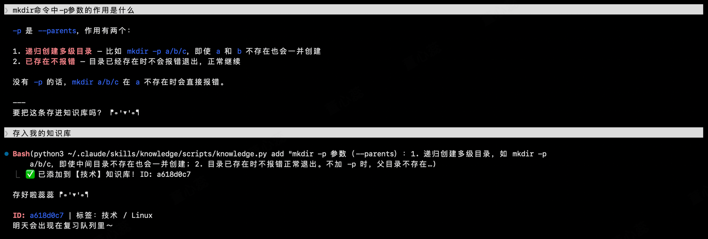
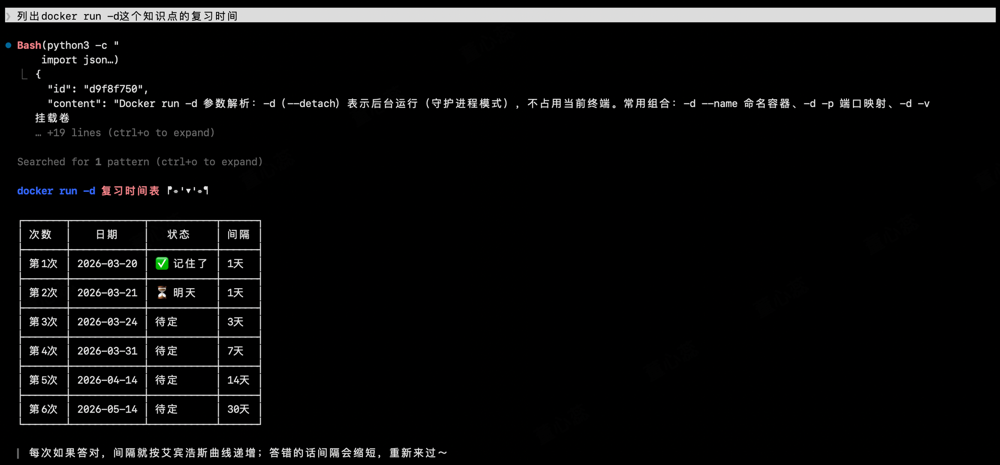
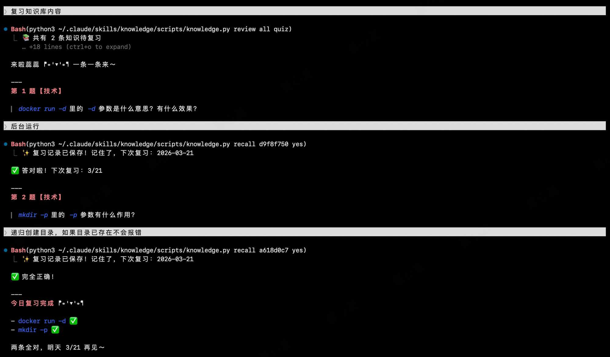

# 🧠 Knowledge Base for Claude Code

一个基于遗忘曲线的知识管理工具，帮你记住与Claude Code交流中摄取的新知识、定期复习。

> 平时看到有用的知识点，随手丢进去，系统会按 1/3/7/14/30 天的间隔提醒你复习。

## 效果预览

#### 存入



#### 复习



#### 复习时间



## 快速开始

### 1. 安装

**Claude Code 用户**

```bash
git clone https://github.com/Dxrabbit/knowledge-skill.git ~/.claude/skills/knowledge-skill
```

重启 Claude Code，skill 会自动加载。

**其他平台/独立使用**

```bash
git clone https://github.com/Dxrabbit/knowledge-skill.git
cd knowledge-skill/scripts
python3 knowledge.py stats
```

### 2. 基本用法

```bash
# 添加知识点
python3 knowledge.py add "HTTP 状态码 301 是永久重定向，302 是临时重定向"

# 带标签（方便分类）
python3 knowledge.py add "Go 的 goroutine 是用户态轻量级线程" "go,并发"

# 查看今天该复习什么
python3 knowledge.py review today

# 标记复习状态（记住了 / 没记住）
python3 knowledge.py recall abc123 yes   # 记住了
python3 knowledge.py recall abc123 no    # 没记住，会缩短下次复习间隔

# 查看统计
python3 knowledge.py stats
```

### 3. 配置自动识别（可选）

想让 Claude 自动识别"加到知识库"这种话？配置一个 hook：

```bash
python3 knowledge.py setup
```

按提示复制命令执行，或者手动配置：

```bash
/update-config add user-prompt-submit-hook '
#!/bin/bash
if echo "$CLAUDE_USER_PROMPT" | grep -qi "知识库"; then
    content=$(echo "$CLAUDE_USER_PROMPT" | sed '"'"'s/加入.*知识库//g; s/添加到.*知识库//g'"'"')
    python3 ~/.claude/skills/knowledge-skill/scripts/knowledge.py auto-add "$content"
fi
'
```

## 复习模式

**quiz 模式**（默认）- 先回忆再看答案：
```
📚 【技术】第2次复习（间隔3天）

💭 还记得这个吗？
   「Go 的 goroutine 是...」

📝 回复以下指令：
   • "python3 knowledge.py recall d9f8f750 yes"  - 记住了
   • "python3 knowledge.py recall d9f8f750 no"   - 没记住
```

**show 模式** - 直接展示：
```bash
python3 knowledge.py review today show
```

## 数据存在哪里

`~/.claude/memory/knowledge_base.json`

纯 JSON 格式，可以随时导出、备份、或者自己写脚本处理。

## 自定义

改分类？编辑 `knowledge.py` 里的 `CATEGORY_KEYWORDS`：

```python
CATEGORY_KEYWORDS = {
    "技术": ["代码", "python", "docker", "git", ...],
    "工作": ["会议", "okr", "需求", ...],
    "读书": ["书", "作者", "笔记", ...],
    # 自己加...
}
```

## 为什么是这些间隔

基于艾宾浩斯遗忘曲线：

| 次数 | 间隔 |
|-----|------|
| 第1次 | 1天后 |
| 第2次 | 3天后 |
| 第3次 | 7天后 |
| 第4次 | 14天后 |
| 第5次+ | 30天后 |

没记住的话会重置回短间隔。

## 文件结构

```
knowledge-skill/
├── SKILL.md              # Claude Code 技能描述
├── README.md             # 本文件
├── LICENSE               # MIT 协议
├── images/               # 截图
└── scripts/
    └── knowledge.py      # 主程序
```

